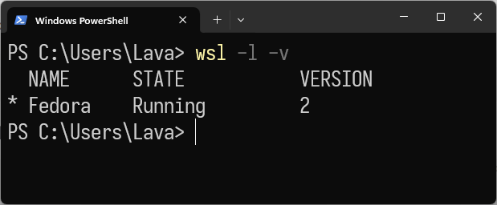
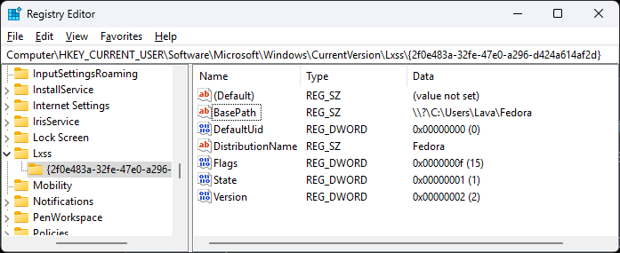

They should've told us about this waaay before July 2024. Turning any container image into WSL2 distro, I'll be using `fedora` to demonstrate.

<details>
<summary>Ranting</summary>

I've been using Ubuntu on WSL and Ubuntu Server on my server for years. At the time of writing, Canonical has released Ubuntu 24.04 LTS with many updates, especially in the toolchains. However, it feels bloated to me; I prefer something minimal and stable, but this isn't enough reason for me to switch distributions yet. A few days ago, I SSHed into my server and ran a regular `sudo apt update`, but I encountered a warning about a conflicting update. It suggested I run `apt --fix-broken install`, which I did, and it broke many system packages.

I still wanted to use Ubuntu Server, so I downloaded the latest installation image, only to find that my server doesn't work with the GRUB bootloader. It works to boot installed Linux, but not when booting the Linux installation image, so I had to use Syslinux. Since Ubuntu 22, they switched to GRUB for the installation image, so I opted for version 20. However, for some reason, it couldn't resolve the IP address for some repositories when installing additional packages, and that was the last straw for me.

Considering my server's use case, where I only need to run containers and want to avoid regular maintenance, I need the host distribution to be as stable as possible, widely adopted, and as "upstream" as possible. My options were Debian, Fedora, and Arch. The latter two were out of the question since Fedora releases a new version every six months, and Arch is a rolling release. Debian, on the other hand, releases every three years, and the previous release has an additional two years of LTS, so I went with Debian. It turns out Debian allows you to choose your desktop environment during the installation process and whether you want an SSH server. I chose not to install a DE and to install the SSH server, and after completion, it worked just like Ubuntu Server did years ago.

As for WSL, even though it still works perfectly fine, version 24 and all the toolchain updates feel bloated, so I decided to switch to another distribution. Debian is on the official support list when I run `wsl -l -o`, but since this is my development environment, I prefer something more up-to-date and doesn't break when I do an update, so Fedora was my final decision.

Fedora Remix requires me to wait for their fork to upgrade before I can proceed with my own upgrade whenever a new release is available. It turns out that WSL functions similarly to a container, allowing the use of any image as a WSL distro. However, the process was not seamless, which is the reason for the existence of this article.
</details>

## Install WSL

> There are a ton of guides on the internet but here's one to avoid jumping to another article if you haven't installed it yet.

- `Windows + S` > type `Turn Windows features`
- Open `Turn Windows features on or off`
- Enable `Virtual Machine Platform` and `Windows Subsystem for Linux` > `OK` > Restart
- `Windows + X` > `Terminal` or `PowerShell`
- `wsl --update`
- `wsl --install` and follow the instructions

## Install Docker Engine

Follow [this guide](https://docs.docker.com/engine/install/ubuntu/) to install Docker Engine on Ubuntu. No need for the post-installation steps since we only need them to extract the Fedora image from the Docker image.

## Extract the image

Run an empty container using the latest Fedora image
```bash
sudo docker run -t --name wsl_export fedora ls /
```

Export the container using its name to a `.tar` file
```bash
sudo docker export wsl_export > /mnt/c/fedora-rootfs.tar
```

## Import the image & clean up

```powershell
wsl --import Fedora C:\Fedora C:\fedora-rootfs.tar
```

Afterwards you can remove the `.tar` file and the WSL distro.

```powershell
Remove-Item C:\fedora-rootfs.tar
wsl --unregister Ubuntu
```

In Windows Search, search for `Ubuntu` and uninstall it.

At this point, you should see the `Fedora` distro in the WSL distro list.



> Ignore the running state since I'm using it to write this article.

## Post-installation

- Set default distro for WSL
    ```powershell
    wsl --set-default Fedora
    ```

- Path fixes

    Enter the distro
    ```powershell
    wsl
    ```

    Upon starting, you should expect a bunch of `ERROR: UtilTranslatePathList` messages. This is because Fedora was not shut down ["properly"](https://askubuntu.com/a/1442829) after when we use `docker run` to pull the image, create a container, run a command, and exit. To resolve this, terminate the WSL from Windows, not from within, and then relaunch it.
    ```powershell
    wsl --terminate Fedora
    wsl
    ```
    > In the future you should avoid shutdown WSL from the inside, use `wsl --shutdown`.

- Update & install additional packages
    > The term "essential" is subjective, but commonly, developers would require tools like `wget`, `curl`, `sudo`, and `git` for development tasks. However, these are not always included in Docker images by default since their primary use is for deployment.
    ```bash
    dnf update
    dnf install wget curl sudo git passwd ncurses dnf-plugins-core dnf-utils findutils nano
    ```

-   Add user & set password
    ```bash
    useradd -G wheel yourusername
    passwd yourusername
    ```

- Set default user in `wsl.conf` & enable `systemd`
    ```bash
    sudo nano /etc/wsl.conf
    ```

    Add the following lines
    ```bash
    [boot]
    systemd = true

    [user]
    default = yourusername
    ```
    > Omit the `systemd` part if your distro doesn't use systemd.

    then restart WSL
    ```powershell
    wsl --shutdown
    wsl
    ```

## WSLg
- Systemd service to recreate X11 socket symlink
    ```bash
    sudo nano /usr/lib/systemd/system/wslg-tmp-x11.service
    ```

    Paste the following contents

    ```
    [Unit]
    Description=Recreate WSLg X display file link after /tmp mounted
    ConditionPathIsDirectory=/mnt/wslg/.X11-unix
    Requires=tmp.mount
    After=tmp.mount
    Before=systemd-tmpfiles-setup.service

    [Service]
    Type=oneshot
    ExecStart=/bin/chmod +t /mnt/wslg/.X11-unix
    ExecStart=-/bin/rmdir /tmp/.X11-unix
    ExecStart=/bin/ln -sf /mnt/wslg/.X11-unix /tmp/.X11-unix
    #ExecStart=/bin/mount -m -o bind /mnt/wslg/.X11-unix /tmp/.X11-unix

    [Install]
    WantedBy=default.target
    ```
- Systemd service to recreate WSLg sockets files in `$XDG_RUNTIME_DIR`
    ```bash
    sudo nano /usr/lib/systemd/user/wslg-runtime-dir.service
    ```

    Paste the following contents

    ```
    [Unit]
    Description=Recreate WSLg sockets files in $XDG_RUNTIME_DIR
    ConditionPathIsDirectory=/mnt/wslg/runtime-dir

    [Service]
    Type=oneshot
    ExecStart=/bin/sh -c "ln -fs /mnt/wslg/runtime-dir/* "%t

    [Install]
    WantedBy=default.target
    ```

- Start these services
    ```bash
    sudo systemctl enable wslg-tmp-x11
    sudo systemctl --global enable wslg-runtime-dir
    ```

Everything else, X11 or Wayland-related, should be included in the dependency list of the GUI application you're installing.

## Miscellaneous
### Taskbar Shortcut
If you're using Windows Terminal (btw you should), you can create a shortcut to open the WSL distro in Windows Terminal and pin it to the taskbar.
- Right-click on desktop > `New` > `Shortcut`
- Paste the following path
    ```
    %userprofile%\AppData\Local\Microsoft\WindowsApps\wt.exe -p Fedora
    ```
- `Next` > enter `Fedora` > `Finish`
- Hold `Alt` and double click on the shortcut to open its `Properties` panel
- Select `Change Icon...` and use this <a href="./any-distro-on-wsl/fedora.ico" download>fedora.ico</a>
- Drag the shortcut onto the taskbar
    

## Best practices for backup & restore
- Find and remove unnecessary files and directories with [`ncdu`](https://dev.yorhel.nl/ncdu) (v2.5 and above)
    ```
    sudo /path/to/ncdu -t8 --exclude /mnt /
    ```

- Shrink the WSL2 `.vhdx` disk

    Identify the `ext4.vhdx` file from the location you specified during the [import](#import-the-image-clean-up) process OR in `regedit` at
    ```
    Computer\HKEY_CURRENT_USER\Software\Microsoft\Windows\CurrentVersion\Lxss\
    ```
    

    the `ext4.vhdx` should be in the `BasePath` folder.

    Launch `diskpart` using Terminal, PowerShell or Command Prompt
    ```cmd
    diskpart
    ```
    and execute the following commands line by line
    ```cmd
    select vdisk file="path\to\ext4.vhdx"
    attach vdisk readonly
    compact vdisk
    detach vdisk
    exit
    ```

- To backup, copy the whole `ext4.vhdx` file to another location or use
    ```PowerShell
    wsl --export --vhd <Distribution Name> <FileName>
    ```

- To restore, use
    ```PowerShell
    wsl --import --vhd <Distribution Name> <InstallLocation> <FileName>
    ```

## References
- [Import any Linux distribution to use with WSL | Microsoft](https://learn.microsoft.com/en-us/windows/wsl/use-custom-distro)
- [Using Fedora 33 with Microsoft’s WSL2 | Fedora Magazine](https://fedoramagazine.org/wsl-fedora-33/)
- [How to set default user for manually installed WSL distro? | superuser](https://superuser.com/a/1566031)
- [Multiple UtilTranslatePathList errors when restarting Ubuntu on WSL after a shutdown | AskUbuntu](https://askubuntu.com/a/1442829)
- [Advanced settings configuration in WSL | Microsoft](https://learn.microsoft.com/en-us/windows/wsl/wsl-config)
- [Basic commands for WSL | Microsoft](https://learn.microsoft.com/en-us/windows/wsl/basic-commands)
- [libGLESv2.so.2: cannot open shared object file: No such file or directory | Qt Forum](https://forum.qt.io/topic/137040/libglesv2-so-2-cannot-open-shared-object-file-no-such-file-or-directory)
- [Diagnosing "cannot open display" type issues with WSLg | GitHub - wslg](https://github.com/microsoft/wslg/wiki/Diagnosing-%22cannot-open-display%22-type-issues-with-WSLg)
- [viruscamp/wslg-links | Recreate WSLg sockets after `/tmp` and `$XDG_RUNTIME_DIR` mounted](https://github.com/viruscamp/wslg-links)

<style>
main img {
    @apply rounded-lg;
}
</style>