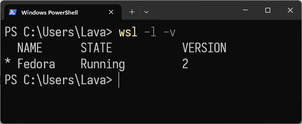
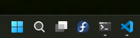
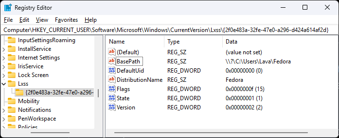

## Quickstart

Get your favorite Linux distro running in WSL in minutes:

- Export a container image as a rootfs tarball.
- Import it into WSL and remove leftovers.
- Set your new distro as the default.

```bash
# Export Fedora image
sudo docker run -t --name export-fedora fedora ls /
sudo docker export export-fedora > /mnt/c/fedora-rootfs.tar

# Import and clean up
wsl --import Fedora C:\Fedora C:\fedora-rootfs.tar
Remove-Item C:\fedora-rootfs.tar   # in PowerShell
wsl --unregister Ubuntu
wsl --set-default Fedora
```

> You can skip steps 1 and 2 by asking one of your friends who already has Docker or Podman running to export the distro for you.

### Prerequisites

- WSL2 enabled on Windows (run `wsl --install`).
- Docker Engine installed in your WSL distro (needed only for export).

> There are a ton of guides on the internet but here's one to avoid jumping to another article if you haven't installed it yet.

- `Windows + S` > type `Turn Windows features`
- Open `Turn Windows features on or off`
- Enable `Virtual Machine Platform` and `Windows Subsystem for Linux` > `OK` > Restart
- `Windows + X` > `Terminal` or `PowerShell`
- `wsl --update`
- `wsl --install` and follow the instructions

Follow [this guide](https://docs.docker.com/engine/install/ubuntu/) to install Docker Engine on Ubuntu. No need for the post-installation steps since we only need them to extract the Fedora image from the Docker image.

## Exporting the distro

Pull and export any image (here Fedora):

```bash
sudo docker run -t --name export-fedora fedora ls /
```

Save the container fs to a tarball:

```bash
sudo docker export export-fedora > /mnt/c/fedora-rootfs.tar
```

## Importing into WSL

Run in PowerShell:

```powershell
wsl --import Fedora C:\Fedora C:\fedora-rootfs.tar
Remove-Item C:\fedora-rootfs.tar
wsl --unregister Ubuntu
```

Afterwards you can remove the `.tar` file and the old distro

```powershell
Remove-Item C:\fedora-rootfs.tar
wsl --unregister Ubuntu
```

Now you should see `Fedora` in your WSL distros list.

At this point, you should see the `Fedora` distro in the WSL distro list.



## Post-installation tweaks

- Set default distro for WSL

    ```powershell
    wsl --set-default Fedora
    ```

- Path fixes
  Upon starting using the `wsl` command, you might see a bunch of `ERROR: UtilTranslatePathList` messages. This happens because Fedora wasn't shut down ["the-wsl-way"](https://askubuntu.com/a/1442829) in the second step. Just terminate it from Windows and relaunch it.

    ```powershell
    wsl --terminate Fedora
    wsl
    ```

    > In the future you should avoid shutting down WSL from the inside, use `wsl --shutdown` instead.

- Update & install additional packages

Update and add essentials:

```bash
dnf update && \
dnf install wget curl sudo git passwd ncurses dnf-utils nano
```

    > You may remove those you know and don't need.

- Add user & set password

    ```bash
    useradd -G wheel yourusername
    passwd yourusername
    ```

- Set default user in `wsl.conf` & enable `systemd`
  Modify the `wsl.conf` file using a text editor

    ```bash
    sudo nano /etc/wsl.conf
    ```

    Paste the following contents

    ```bash
    [boot]
    systemd = true

    [user]
    default = yourusername
    ```

    > Omit the `systemd` part if your distro doesn't use systemd.

    then restart WSL

    ```powershell
    wsl --shutdown
    wsl
    ```

### Enabling GUI (WSLg)

We are creating two `systemd` services to automatically generate two symlink files on startup for the X11 socket.

1. `/tmp/.X11-unix` -> `/mnt/wslg/.X11-unix`
   First create the service file

    ```bash
    sudo nano /usr/lib/systemd/system/wslg-tmp-x11.service
    ```

    Paste the following contents

    ```
    [Unit]
    Description=Recreate WSLg X display file link after /tmp mounted
    ConditionPathIsDirectory=/mnt/wslg/.X11-unix
    Requires=tmp.mount
    After=tmp.mount
    Before=systemd-tmpfiles-setup.service

    [Service]
    Type=oneshot
    ExecStart=/bin/chmod +t /mnt/wslg/.X11-unix
    ExecStart=-/bin/rmdir /tmp/.X11-unix
    ExecStart=/bin/ln -sf /mnt/wslg/.X11-unix /tmp/.X11-unix
    ExecStart=/bin/mount -m -o bind /mnt/wslg/.X11-unix /tmp/.X11-unix

    [Install]
    WantedBy=default.target
    ```

2. `$XDG_RUNTIME_DIR` -> `/mnt/wslg/runtime-dir`
   Create the service file

    ```bash
    sudo nano /usr/lib/systemd/user/wslg-runtime-dir.service
    ```

    Paste the following contents

    ```
    [Unit]
    Description=Recreate WSLg sockets files in $XDG_RUNTIME_DIR
    ConditionPathIsDirectory=/mnt/wslg/runtime-dir

    [Service]
    Type=oneshot
    ExecStart=/bin/sh -c "ln -fs /mnt/wslg/runtime-dir/* "%t

    [Install]
    WantedBy=default.target
    ```

Finally, enable the services

```bash
sudo systemctl enable wslg-tmp-x11
sudo systemctl --global enable wslg-runtime-dir
```

Everything else, X11 or Wayland-related, should be included in the dependency list of the GUI application you're installing.

## Advanced: backup & restore

### Taskbar Shortcut

If you're using Windows Terminal (btw you should), you can create a shortcut to open the WSL distro in Windows Terminal and pin it to the taskbar.

- Right-click on desktop > `New` > `Shortcut`
- Paste the following path
    ```
    %userprofile%\AppData\Local\Microsoft\WindowsApps\wt.exe -p Fedora
    ```
- `Next` > enter `Fedora` > `Finish`
- Hold `Alt` and double click on the shortcut to open its `Properties` panel
- Select `Change Icon...` and use this <a href="./any-distro-on-wsl/fedora.ico" download>fedora.ico</a>
- Drag the shortcut onto the taskbar
  

## Best practices for backup & restore

- Find and remove unnecessary files and directories with [`ncdu`](https://dev.yorhel.nl/ncdu) (v2.5 and above)

    ```
    sudo /path/to/ncdu -t8 --exclude /mnt /
    ```

- Shrink the WSL2 `.vhdx` disk

    Identify the `ext4.vhdx` file from the location you specified during the [import](#import-the-image-clean-up) process OR in `regedit` at

    ```
    Computer\HKEY_CURRENT_USER\Software\Microsoft\Windows\CurrentVersion\Lxss\
    ```

    

    the `ext4.vhdx` should be in the `BasePath` folder.

    Launch `diskpart` using Terminal, PowerShell or Command Prompt

    ```cmd
    diskpart
    ```

    and execute the following commands line by line

    ```cmd
    select vdisk file="path\to\ext4.vhdx"
    attach vdisk readonly
    compact vdisk
    detach vdisk
    exit
    ```

- To backup, copy the whole `ext4.vhdx` file to another location or use

    ```PowerShell
    wsl --export --vhd <Distribution Name> <FileName>
    ```

- To restore, use
    ```PowerShell
    wsl --import --vhd <Distribution Name> <InstallLocation> <FileName>
    ```

## References

- [Import any Linux distribution to use with WSL | Microsoft](https://learn.microsoft.com/en-us/windows/wsl/use-custom-distro)
- [Using Fedora 33 with Microsoft’s WSL2 | Fedora Magazine](https://fedoramagazine.org/wsl-fedora-33/)
- [How to set default user for manually installed WSL distro? | superuser](https://superuser.com/a/1566031)
- [Multiple UtilTranslatePathList errors when restarting Ubuntu on WSL after a shutdown | AskUbuntu](https://askubuntu.com/a/1442829)
- [Advanced settings configuration in WSL | Microsoft](https://learn.microsoft.com/en-us/windows/wsl/wsl-config)
- [Basic commands for WSL | Microsoft](https://learn.microsoft.com/en-us/windows/wsl/basic-commands)
- [libGLESv2.so.2: cannot open shared object file: No such file or directory | Qt Forum](https://forum.qt.io/topic/137040/libglesv2-so-2-cannot-open-shared-object-file-no-such-file-or-directory)
- [Diagnosing "cannot open display" type issues with WSLg | GitHub - wslg](https://github.com/microsoft/wslg/wiki/Diagnosing-%22cannot-open-display%22-type-issues-with-WSLg)
- [viruscamp/wslg-links | Recreate WSLg sockets after `/tmp` and `$XDG_RUNTIME_DIR` mounted](https://github.com/viruscamp/wslg-links)

<style>
main img {
    border-radius: var(--radius-lg)
}
</style>
