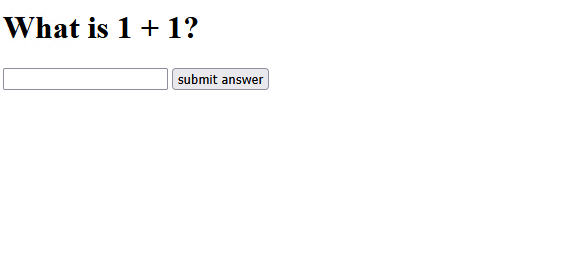
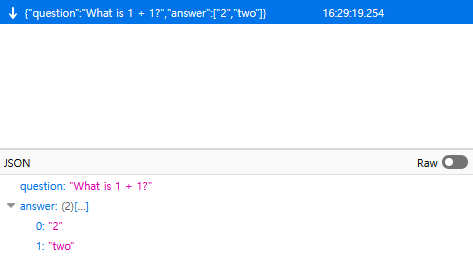

> welcome to my quiz! it is 4 questions and very hard. if you solve everything
> ill give u a cool flag!!!

<!-- TODO: challenge files -->

One more year, one more season of LexMACS's very own [LIT CTF](https://lit.lhsmathcs.org/)
event. Being the team's web main, I managed to solve 6 out of 9 challenges, and
I'm doing some writeups for the ones I find interesting!

Our placement wasn't as high as last year, as local autist
[beerpsi](https://github.com/beerpsi) was absolutely demolished by his finals,
and it's mainly me doing solves. But, nonetheless, we had fun solving the
challenges! Anyways, that's enough yapping, time for the actual challenge itself!

## The challenge

We're given a simple website with a quiz, like below.



Answering each question correctly would move us on to the next one, and by
taking a peek at the included `questions.json` file, you could see that we
needed to reach the 5th question - the last one, to see the flag:

```json
[
	{
		"question": "What is 1 + 1?",
		"answer": ["REDACTED", "REDACTED"]
	},
	{
		"question": "What is the molecular geometry of methane?",
		"answer": ["REDACTED", "REDACTED"]
	},
	{
		"question": "Turbo the snail is in the top row of a grid with 2024 rows and 2023 columns and\nwants to get to the bottom row. However, there are 2022 hidden monsters, one in\nevery row except the first and last, with no two monsters in the same column.\nTurbo makes a series of attempts to go from the first row to the last row. On\neach attempt, he chooses to start on any cell in the first row, then repeatedly moves\nto an orthogonal neighbor. (He is allowed to return to a previously visited cell.) If\nTurbo reaches a cell with a monster, his attempt ends and he is transported back to\nthe first row to start a new attempt. The monsters do not move between attempts,\nand Turbo remembers whether or not each cell he has visited contains a monster. If\nhe reaches any cell in the last row, his attempt ends and Turbo wins.\nFind the smallest integer n such that Turbo has a strategy which guarantees being\nable to reach the bottom row in at most n attempts, regardless of how the monsters\nare placed.",
		"answer": ["REDACTED", "REDACTED"]
	},
	{
		"question": "What is the answer to this question?",
		"answer": ["REDACTED"]
	},
	{
		"question": "LITCTF{REDACTED}",
		"answer": [""]
	}
]
```

## Poking around

Below's the challenge's `main.js`, included as part of the challenge's source code.

```js
const ws = new WebSocket('ws://' + location.host + '/ws')

const input = document.getElementById('submission')

ws.onmessage = (event) => {
	let data = JSON.parse(event.data)
	document.getElementById('question').innerHTML = data['question']
	input.value = ''
}

function start() {
	document.getElementById('pre').hidden = true
	document.getElementById('main').hidden = false
	submit('')
}

function submit() {
	ws.send(input.value)
}
```

This opens up a [WebSocket](https://en.wikipedia.org/wiki/WebSocket) connection
to the `/ws` endpoint, as described in `index.js` below. As you hit the submit
button on the form, it will send the value through the WebSocket as the message.

```js
const express = require('express')
const app = express()
const expressWS = require('express-ws')(app)
const PORT = 8080

const questions = require('./questions.json')

app.ws('/ws', function (ws, req) {
	let count = 0
	ws.on('message', (msg) => {
		if (count < 4 && questions[count]['answer'].includes(msg)) {
			++count
			ws.send(JSON.stringify(questions[count]))
		} else {
			count = 0
			ws.send(JSON.stringify(questions[count]))
		}
	})
})

app.get('/', function (req, res) {
	res.sendFile('index.html', { root: __dirname })
})
app.get('/main.js', function (req, res) {
	res.sendFile('main.js', { root: __dirname })
})

app.listen(PORT, () => {
	console.log(PORT)
})
```

Meanwhile, `index.js` is an Express app, that both serves our webpage for the
form, as well as the WebSocket endpoint itself. It loads the questions set from
`questions.json`, and upon receiving a message, it will check whether or not the
message's value matches the current question's answer(s). If it does, it will
increment the question counter, else, you'll be sent back to the first question.

## A simple oversight

Giving this a bit of scrutinizing, you could see the entire thing is revolving
around serializing _the entire question and answer_ object through the WebSocket!

Both `index.js`:

```js
let data = JSON.parse(event.data)
document.getElementById('question').innerHTML = data['question']
```

...and `main.js`:

```js
ws.send(JSON.stringify(questions[count]))
```

sends and expects an entire object! What this means is, we can easily open up
our Network tab in our browser's DevTools and inspect the WebSocket connection...



Answering all the questions with any of its answers would give us the flag as
the last question, `LITCTF{why_d1d_i_m4ke_thls}`!
